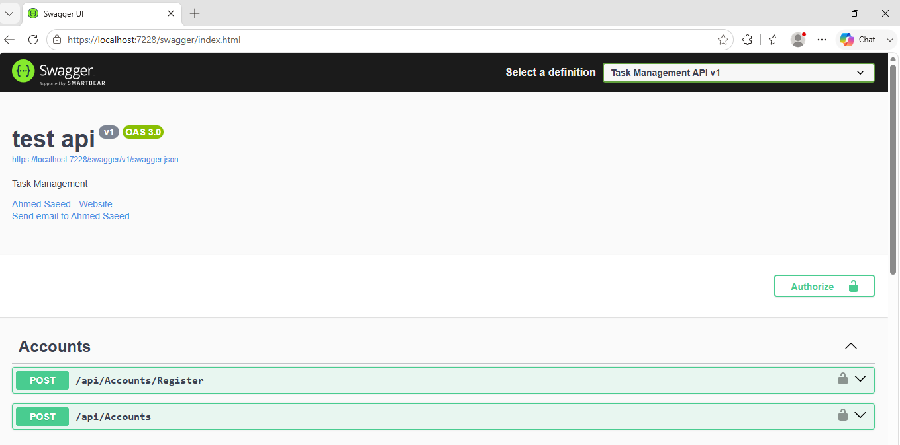
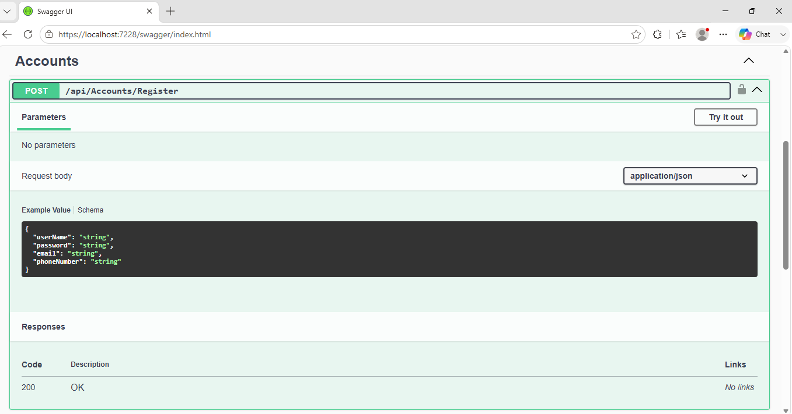
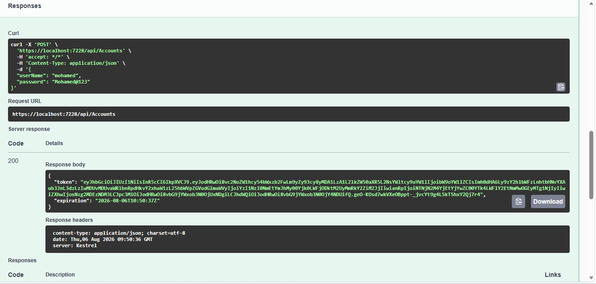
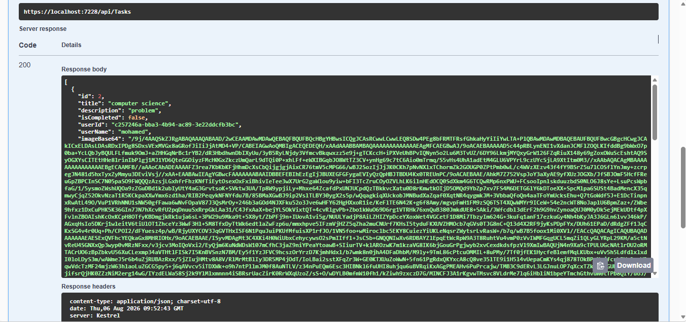
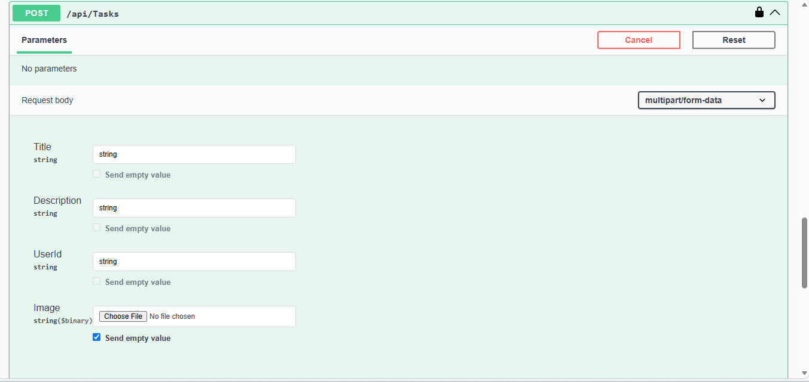
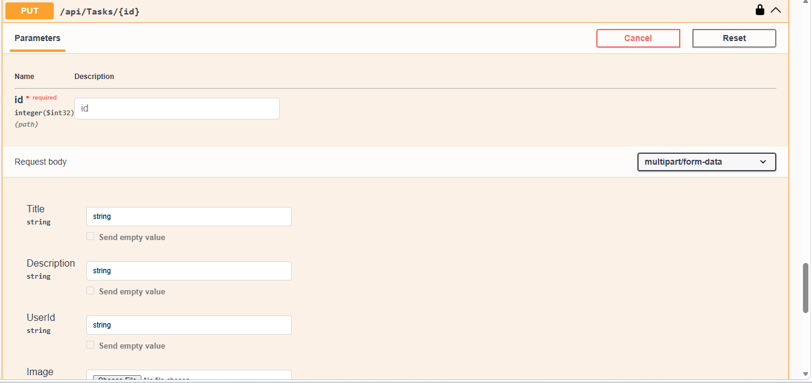
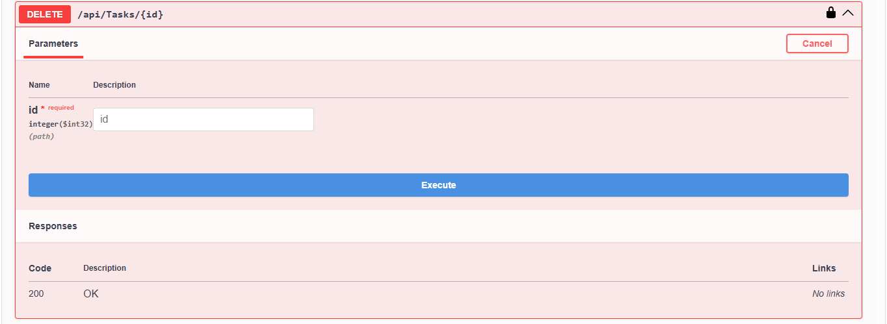

<h1 align="center">📌 Task Management API</h1>

A secure, scalable, and production-style <b>RESTful API</b> built with ASP.NET Core Web API following Clean Architecture and CQRS principles.

  
  
  
  

---

## 🚀 Overview

The **Task Management API** is a backend-focused RESTful service designed to simulate real-world task management systems with secure authentication, role-based authorization, and scalable architecture.

It is built with a strong emphasis on:
- Clean Architecture
- Security best practices
- Maintainability
- Real-world backend design patterns

---

## ✨ Key Features

### 🔐 Authentication & Authorization
- User Registration & Login system
- JWT Authentication with custom claims
- Role-Based Authorization (Admin / User)
- Secure access control per endpoint

### 📌 Task Management
- Full CRUD operations for tasks
- User-specific task ownership validation
- Task status tracking
- Secure data access per user

### 📎 File Management
- Upload attachments for tasks
- Server-side validation
- Secure file handling and storage

### 🧠 Backend Engineering Features
- CQRS pattern using MediatR
- Global exception handling middleware
- Fluent validation & request validation
- Logging system for debugging & monitoring

---

## 🛠 Tech Stack

**Backend**
- ASP.NET Core Web API
- C#

**Database**
- SQL Server
- Entity Framework Core
- LINQ

**Security**
- ASP.NET Core Identity
- JWT Authentication

**Architecture & Patterns**
- CQRS (MediatR)
- Repository Pattern
- Clean Architecture
- DTO-based API design

**Tools**
- Swagger / Swashbuckle
- Postman

---

## 🧱 Architecture Overview

The system is structured into clean layers:

- 🏛 Presentation Layer (API Controllers)
- 🧠 Application Layer (CQRS - Commands & Queries)
- 🗄 Domain Layer (Entities & Core Logic)
- 💾 Infrastructure Layer (Database & External Services)

Key principles:
- Separation of Concerns
- Dependency Injection
- SOLID Principles
- Maintainable & testable structure

---

## 🔐 Authentication Flow

The API uses JWT-based authentication:

### Endpoints
- `POST /api/accounts/register`
- `POST /api/accounts/login`

### Usage Example
After login, include token in request header:

---

## 📌 API Endpoints

### 👤 Accounts
- POST `/api/accounts/register`
- POST `/api/accounts/login`

### 📋 Tasks
- GET `/api/tasks`
- GET `/api/tasks/{id}`
- POST `/api/tasks`
- PUT `/api/tasks/{id}`
- DELETE `/api/tasks/{id}`

---

## 📎 File Upload Feature

- Upload attachments per task
- Validation for file type & size
- Secure storage handling
- Linked to task entity

---

## 📸 API Documentation

Interactive API documentation available via Swagger:

- Swagger UI for testing endpoints
- Request/Response models documentation
- Easy Postman integration

---

## 🧪 Testing Tools

- Swagger UI (built-in)
- Postman collection support
- Manual API testing for validation

---
---

## 📸 Screenshots

### 🔹 Swagger UI

  

---

### 🔹 User Registration

  

---

### 🔹 User Login (JWT Token)

  

---

### 🔹 Get All Tasks

  

---

### 🔹 Create Task

  

---

### 🔹 Update Task

  

---

### 🔹 Delete Task

  

---

### 🔹 JWT Token

  

---

### 🔹 get by id task

  

---

## 🎯 What This Project Demonstrates

- Building production-style RESTful APIs
- Implementing secure authentication systems (JWT + Identity)
- Applying CQRS pattern in real-world scenarios
- Designing scalable backend architecture
- Enforcing clean code and separation of concerns
- Handling user-based authorization logic

---

## 🚀 Future Improvements

- Refresh Token implementation
- Unit & Integration testing (xUnit)
- Caching layer (Redis)
- Rate limiting & throttling
- Background jobs (Hangfire)
- Advanced logging (Serilog + ElasticSearch)

---

## 💡 Key Takeaway

> “A strong backend system is not just functional — it is secure, scalable, and built with clear architectural boundaries.”

---

🚀 Built with focus on enterprise-grade backend development and real-world system design

